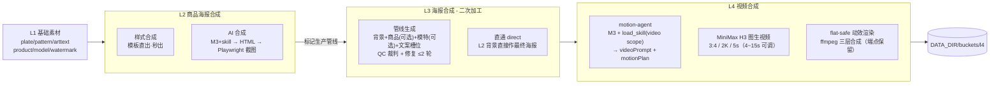
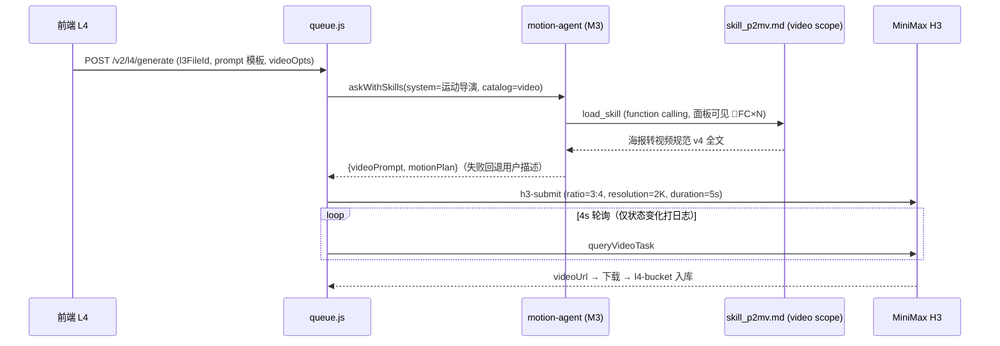

# 双11 京东投流素材 AIGC · 系统架构

> 配套可视化版本：项目根 `architecture.html`（浏览器直接打开）。
> 本文与代码实际结构同步；大版本迭代后请要求重新生成。

## 技术栈

- **后端**：pnpm + Express（端口 8788，测试 8791）+ sharp + Playwright-core + ffmpeg 9.0，ESM，Node v22
- **前端**：Vite + React（`web/src`），构建产物由 Express 托管
- **LLM**：MiniMax M3（chat + function calling）
- **视频**：MiniMax H3（`POST /v2/video_generation`，first_frame / Reference 双模式）
- **数据**：`DATA_DIR/buckets/{l1..l4}` + meta 索引；技能库 `data/skills/`（meta.json + *.md）

## 素材流水线 L1 → L4

## L2 双模式细节

| 模式 | 路径 | 特点 |
|---|---|---|
| 样式合成 | `composeTemplateHtml` | 系统模板直出（默认「完整海报」模板），`parseAdjust` 解析自然语言参数（scale=/到/为、否定守卫、坐标语境跳过），无 LLM、秒出 |
| AI 合成 | `composeHtml` → `finalize` | M3 agent 读 html scope 技能生成 720×1440 绝对定位 HTML；系统级矫正：违规文字清洗、底版无条件强制垫底、商品 z-index:10、艺术字/水印系统定位（alpha 可见中心锚） |

## L3 两种路径

- **管线生成**：L2 标记背景 + 商品图（可选，不选=仅背景重排版）+ 模特图（可选）+ 文案槽位 → sharp 合成 → QC 裁判打分 → `planFromDefects` 修复 ≤2 轮 → 存 L3 桶
- **直通**：`POST /v2/l3/direct`，不选商品/模特时 L2 背景直接作为最终海报（`source: direct`）

## L4 视频链路（skill 驱动）

- 前端右栏参数：ratio（默认 3:4）/ resolution（默认 2K）/ duration（默认 5s，4~15）
- 默认提示词模板（3355 字）逐字预填：相框锁定、标题 100~103%/3~6px、商品 100~102%/5~10px 且更慢、烟雾 scale 恒 1.0、flat-safe/layered 判定、执行优先级「相框稳定 > 一切」
- flat-safe 动效渲染：`/v2/l4/render` ffmpeg 合成（底图锁定 + 标题局部呼吸 1.017/4px/2.4s + 光影流动 + 末帧定格），扁平海报无透明图层时商品/相框静止（skill v4 规范），页面入口已取消、端点保留

## 技能机制与 function calling

- `skills.js`：`skillCatalog(scope)` 按 scope（all/html/copy/qc/video）+ enabled 过滤；`skillTextByKey` 取全文
- `agent/driver.js` `askWithSkills`：目录非空 → 注册 `load_skill` 工具；**目录为空 → `tools=[]` 工具完全清除**（停用即生效，物理不可调）
- 注入点：L2 AI 合成（html）、L3 QC（qc）、L3 文案（copy）、L4 motion-agent（video）
- 面板 `PiTracePanel`：按 traceId 分组，🔧FC×N 徽章、skillsLoaded、adjust-parse/round/load_skill/plate-forced/入库全链；L2 本地 trace 贯穿，L4 以任务 id 分组；H3 轮询降噪（仅状态变化打点）

## 服务端模块（server/）

| 模块 | 职责 |
|---|---|
| `index.js` | Express 启动、静态托管、mock 开关 |
| `routesV2.js` | REST：l1~l4 桶 CRUD/分页、compose-bg（traceId 贯穿）、l3/generate·direct、l4/generate·render、/v2/logs、/v2/skills |
| `queue.js` | 任务管线：stageBackground/stageCompose/stageVideo/flatSafeVideo、修复轮、logEvent |
| `llmCompose.js` | composeHtml/composeTemplateHtml/parseAdjust/finalize |
| `agent/driver.js` | M3 调用 + load_skill 工具循环 + trace |
| `agent/qcAgent.js` | QC 裁判 + 修复计划 |
| `agent/prompts.js` | L2_TEMPLATES（默认完整海报模板）等 |
| `skills.js` | 技能目录 |
| `minimax.js` | M3 chat / 图像 / H3 提交查询 |
| `renderer.js` | Playwright 截图 |
| `storage.js` | buckets + 索引 |
| `agentlog.js` | logEvent/newTrace/queryLogs（pi 调用记录数据源） |
| `compositor/bgcompose/copywriter/layout/styles.js` | sharp 合成、文案、版式、风格库 |

## 前端（web/src）

- 侧栏：基础素材 / 商品海报合成 / 海报合成 - 二次加工 / 视频合成 / 运行日志 / 设置 / 技能
- 共享组件：`PiTracePanel`（L2=biz l2compose，L4=biz l4video）、`AssetCard`/`emptySlot`（190px 固定卡宽网格）、`Preview`（删除 stopPropagation 不冒泡）
- `jfetch` 全局 `cache: 'no-store'`；L4 默认提示词模板常量 `VIDEO_PROMPT_TEMPLATE`

## 关键横切机制

- **trace 分组**：L2 每单入口 newTrace 贯穿；L4 以任务 id 为 traceId
- **逐字保存**：用户提供的提示词/模板原文入库，不改写
- **验证基线**：`node --test tests/*.test.mjs`（42 用例）；前端改动 `cd web && npx vite build` + bundle 指纹校验；LIVE 单据 + 日志证据（traceId / H3 taskId）
